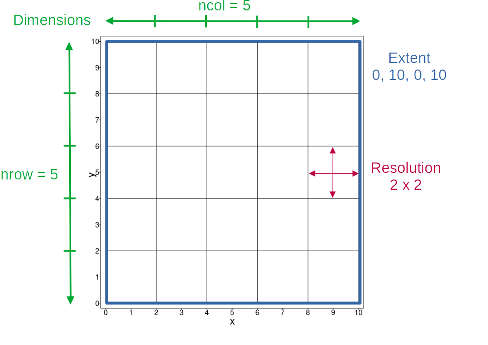
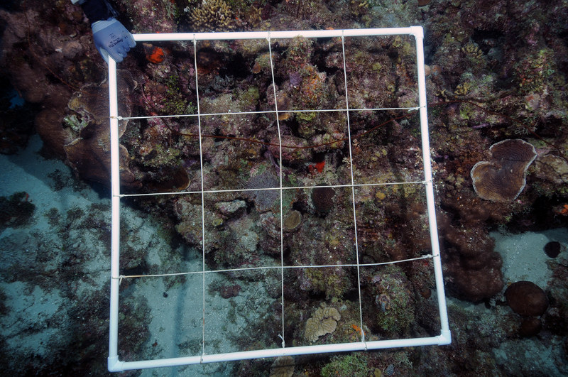
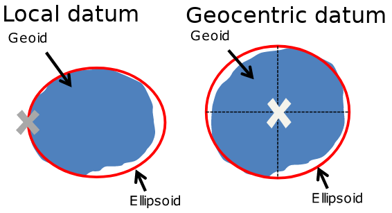
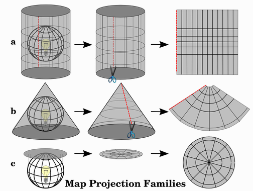

# Introduction

This workshop will provide you with an introduction to manipulating raster spatial data using the R package `terra`. `terra` and its predecessor, `raster` are widely used for spatial data manipulation in R. No prior experience of spatial data is assumed, but this short workshop will not have time to delve into some important aspects of spatial data such as projections. 

We will cover:

- What is a raster?
- Creating and loading rasters in `terra`
- Cropping and masking rasters
- Exploring raster values, including simple statistical summaries and some raster math
- Projecting 
- Multi-layer rasters

`terra`'s predecessor `raster` had many of the same functions as `terra`, and I will mention how functions have changed or been renamed which might be helpful for people migrating from using `raster`. In the words of the creator of both packages: `terra` is simpler, faster and can do more, so definitely switch to `terra` if you are still using `raster`!

::: {.rasterbox}
`raster` users note: Boxes like this will highlight differences between the `raster` package and `terra`.
:::

*Resources*:

- The official `terra` tutorial page is https://rspatial.org/spatial/index.html  
- An excellent reference to all the functions in `terra` is https://rspatial.github.io/terra/reference/terra-package.html
- This website is an good guide to doing GIS work in R using both `terra` and `sf` packages: https://mgimond.github.io/Spatial/index.html 

```{r include=FALSE}
knitr::opts_chunk$set(
  collapse = TRUE,
  comment = "#>"
)
```


## Prerequisites 

You will need the `terra` package installed, which can be done by running `install.packages("terra")`. If you have problems, there are more details about installing it [here](https://rspatial.github.io/terra/index.html). I will also show how to make an interactive map with `terra`, which requires the `leaflet` package to be installed; `install.packages("leaflet")`. 

We can now load the `terra` package:

```{r}
library(terra)
```

# Spatial data

There are basically two types of spatial data: vector and raster

## Vector data 
Can be points, lines or polygons. Useful for representing things like survey locations, rivers, and boundaries. 

```{r class.source='fold-hide'}
pts <- rbind(c(3.2,4), c(3,4.6), c(3.8,4.4), c(3.5,3.8), c(3.4,3.6), c(3.9,4.5)) |>
  vect()

lnes <- as.lines(vect(rbind(c(3,4.6), c(3.2,4), c(3.5,3.8)))) |>
  rbind(as.lines(vect(rbind(c(3.9, 4.5), c(3.8, 4.4), c(3.5,3.8), c(3.4,3.6)))))

lux <- vect(system.file("ex/lux.shp", package = "terra"))

par(mfrow = c(1,3))

plot(pts, axes = F, main = "Points")
plot(lnes, col = "blue", axes = F, main = "Lines")
plot(lux, "NAME_2", col = terrain.colors(12), las = 1, axes = F, main = "Polygons")

par(mfrow = c(1,3))
```

## Raster data 
Raster data is a grid of rectangles, normally called cells. Each cell has a value, making rasters useful for storing continuous data, such as temperature and elevation.

Here is an example of raster data, where each cell in the raster represents elevation.

```{r class.source='fold-hide'}
elev <- system.file("ex/elev.tif", package = "terra") |>
  rast() |>
  aggregate(fact = 2)

plot(elev, las = 1, main = "Elevation map")

elev |>
  as.polygons(aggregate = FALSE, na.rm = FALSE) |>
  lines(col = "grey40", lwd = 0.2)

```

# Getting started

Lets start by creating our own raster. We can create rasters from scratch and load them from a file using the function `rast()`. We can create a simple raster by specifying the x and y limits for the raster and the resolution (how big each cell is).

::: {.rasterbox}
`raster` users note: `rast()` replaces `raster()`
:::


```{r}
#create raster
ras <- rast(xmin = 0, xmax = 10, ymin = 0, ymax = 10, resolution = 2)

#see what we've created
ras
```

The figure below shows what most of the terms above refer to. As you can see, you don't need to use all the terms to define a raster. Couple of other points:

- Every object in R has a class, such as `data.frame` and as you can see, rasters in terra are of class `SpatRaster`. 
- We did not tell `rast()` which coordinate reference system to use, so it defaults to using longitude latitude coordinates, also known as EPSG 4326.

::: {.rasterbox}
`raster` users note: rasters are now `SpatRaster` class not `RasterLayer`
:::

```{r fig.width=6, echo=FALSE}

```

But what does the raster we created actually look like when plotted. Lets see. All we need is `plot()`

```{r, out.width=3}
plot(ras)
```

Why is there no plot? Because the raster we created is empty; there are no values associated with the the cells. Lets assign some values to each cell in the raster and try again. First we will find out how many cells are in our raster using `ncell()

```{r}
ncell(ras)
```

Ok, now we know this lets give our raster cells values from 1 to `r ncell(ras)`:

```{r}
values(ras) <- 1:25

plot(ras)
```

Now our raster has values, we get a plot! Each cell has an integer value between 1 and 25, with cell values increasing from left to right and top to bottom. So the values start being "filled up" in the top left, and finish in the bottom right.

Lets have another look at our raster properties

```{r}
ras
```

We can now see a few extra pieces of information compared to last time:

- `sources(s)`: where is the data held on your computer? It says `memory` for this raster, indicating that the raster is in the computer memory. Rasters can also be held on your hard disk, in which case this will be the file name of the raster. We won't go into details here, but `terra` is smart about loading data into memory, only doing so when it needs to and it thinks it will have enough space.
- `name`: what is the raster called?
- `min value` & `max value`: the minimum and maximum values in the raster

Ok, now we understand the basic structure of a raster, lets load some data.

# Exploring some real world data

Sea surface temperature can be measured by satellites, and the National Oceanic and Atmospheric Administration (NOAA) in the U.S. has been doing so since 1972! Daily sea surface temperature for the world from 1985 to the present is available via the [NOAA Coral Reef Watch website](https://coralreefwatch.noaa.gov/product/5km/index_5km_sst.php). 

We are going to explore sea surface temperature (SST) data for the Great Barrier Reef in Australia. All the data is in the `data` folder in the Github repository, and full details on how I got the data are in the `data_prep.R` script in that folder.

## Load the data

We can use the same `rast()` command that we used to make our own raster to load data The data is stored in GeoTiff (.tif) format, which is widely used for raster data. You can get a full list of data formats that `terra` can read and write by running `gdal(drivers = TRUE)`.

```{r}
sst <- rast("../data/gbr_temp_2023_05_31.tif") #load the data

sst #view the properties
```

If the data loaded correctly, you should see the properties as shown above. We have all the properties I described earlier, but there are a couple of things worth noting:

- the coordinate reference system (crs) is in lon/ lat, which means the unit of measurement is degrees. So the extent coordinates are in degrees, i.e. xmin = `r sprintf("%1.0f", as.numeric(ext(sst)$xmin))`$^\circ$, xmax = `r sprintf("%0.2f", as.numeric(ext(sst)$xmax))`$^\circ$, ymin = `r sprintf("%0.2f", as.numeric(ext(sst)$ymin))`$^\circ$ and ymax =  `r sprintf("%0.2f", as.numeric(ext(sst)$xmax))`$^\circ$, and resolution is also in degrees, i.e `r sprintf("%0.2f", res(sst)[1])`$^\circ$.
- the `source` is the filename of the data we loaded. This means it is on disk, not in memory. We can double check by running `inMemory(sst)` which should return `r inMemory(sst)`.
- `unit` is Celsius. Most rasters don't come with the units, so you will normally need to look at metadata to find this information.

## Plot the data

We want to plot our data to see what it looks like. This is the first thing you should do with almost any spatial data to do a quick check that it looks right

```{r}
plot(sst)
```

The values in the legend seem about what we would expect for water temperatures, ranging from ~10 - 30$^\circ$ Celsius.

The white areas of the plot are cells with `NA` values, which in this case are land; there are no sea surface temperature data for the land! We can see the land mass of Australia taking up much of the map and Papua New Guinea to the north.

We can set the NA values to a different colour if we want, which can be helpful if you want to see some NA cells that are getting lost against the other colours.

```{r}
plot(sst, colNA = "black")
```

Note that every cell within our raster has to have a value. 

## Load and plot some vector data
To put our raster data in context, lets plot the Great Barrier Reef Marine Park boundary (dowloaded from [here](https://geohub-gbrmpa.hub.arcgis.com/datasets/bac38dff14ae4ff9a1c9de5d234e26f8_30/explore)). This is vector data. You might be used to handling vector data with the `sf` package, but `terra` can also be used for vector data manipulation. We can load a vector using `vect()`

::: {.rasterbox}
`raster` users note: `terra` has its own methods for handling vector data unlike `raster` which used the `sp` package for vector data handling. Vector data in `terra` are `SpatVector` objects; different from `sf` objects.
:::

```{r}
#load the park boundary
gbr_boundary <- vect("../data/gbr_MPA_boundary.gpkg")
```

We can plot vector boundaries on top of raster data using `lines()`:

```{r}
#plot the SST data and the boundary on top
plot(sst)
lines(gbr_boundary) #this plots the vector lines over the raster data
```

We now see the outline of the Great Barrier Reef marine park on top of the sea surface temperature data we plotted before.

## Crop and mask data

The data we have at the moment is for a much larger area than just the Great Barrier Reef marine park. To get only that data we need to crop and mask the raster data using the marine park boundary.

Cropping means that we keep only the data inside the **extent** of the vector we are using. Mask means that all the data outside the vector is set to NA or some other value we specify. Lets have a look how this works.

First lets have a look at the extent of the marine park boundary. We can get the extent of a raster or vector using `ext()`. We need to convert this into a `SpatVector` object for plotting using `vect()`. We only need to do this for plotting; when we crop, we can just use the marine park boundary as the input.

::: {.rasterbox}
`raster` users note: `ext()` replaces `extent()`
:::

```{r fig.cap="Cropping means we remove everything outside the extent (blue box) of our polygon. Masking sets all values outside our polygon to NA."}
gbr_boundary_extent <- ext(gbr_boundary) |>
  vect()

plot(sst)
lines(gbr_boundary)
lines(gbr_boundary_extent, col = "blue")
```

So when we crop, we get only the area within the blue box.

We crop using the `crop()` function, using the raster we want to crop as the first argument and the vector we are cropping with second.

```{r}
#crop
sst_cropped <- crop(sst, gbr_boundary)

#plot
plot(sst_cropped)
lines(gbr_boundary)
```

Now we have cropped our raster, we can mask it so that we only have values for the area within the marine park boundary. We do this using `mask`:

```{r}
#mask
sst_cropped_masked <- mask(sst_cropped, gbr_boundary)

#plot
plot(sst_cropped_masked)
lines(gbr_boundary)
```

Now we only see raster values for cells that are within the marine park boundary. But remember that the areas that are white, still have values, they are just `NA` values.

Often we want to `crop` and `mask` one after the other, and you can do this in one command using `crop(sst, gbr_boundary, mask = TRUE)`. 

For reference, here is a figure comparing what `crop`, `mask` and `crop(mask = TRUE)` do:

```{r class.source='fold-hide'}
par(mfrow = c(2,2))

plot(sst, main = "Original raster")
lines(gbr_boundary)

plot(sst_cropped, main = "Cropped")
lines(gbr_boundary)

sst |>
  mask(gbr_boundary) |>
  plot(main = "Masked")
lines(gbr_boundary)

plot(crop(sst, gbr_boundary, mask = TRUE), main = "Cropped and masked")
lines(gbr_boundary)

par(mfrow = c(1,1))
```

Why not just mask rather than crop and mask? As we see in the figure above, this would mean we have a lot of area we are not interested in and even though most of those cells would be `NA` they take up space in our raster, so it is not efficient.

## Raster values

Now we have cropped and masked our original raster to get only data within the area we are interested in, we can start exploring the values. `terra` has several functions that can help us do this easily.

### Histogram

We can get a histogram of all the values in our raster using the `hist()` function, which is equivalent to the base R function.

```{r}
hist(sst_cropped_masked)
```

The x-axis is in the units of our raster values; temperature in degrees Celsius in our case. The y-axis is frequency; how many cells in our raster have those values.

You can change the histogram using the same arguments you use with `hist()` in base R. For example, lets increase the number of bars we have:

```{r}
hist(sst_cropped_masked, breaks = 100)
```

### Frequency table 

We can get a frequency table of values in our raster using `freq()`. This is essentially the same information that is shown in the histogram in graphical format.

```{r}
freq(sst_cropped_masked)
```

The default is to round values to the nearest integer. To get more integers we can do:

```{r}
freq(sst_cropped_masked, digits = 1) |>
  head() #this is a long table: just show the first few values
```

We can also check how many NA values are in our raster:

```{r}
freq(sst_cropped_masked, value = NA)
```

### Statistics

We can use the same `summary()` command that is used in base R to get a summary of the statistical information for an entire raster.

```{r}
summary(sst_cropped_masked)
```

These values are, for example, the mean value of all raster values excluding `NA`s.

To get individual statistical values, we need to use `global()`. For example to get the mean value of a raster:

```{r}
global(sst_cropped_masked, "mean")
```

Hmmm, what went wrong? The default is for `global()` to include all values in the raster, and since we have lots of `NA`s, the result is `NaN`. We need to set `na.rm = TRUE` to exclude the `NA` values.

```{r}
global(sst_cropped_masked, "mean", na.rm = TRUE)
```

The object returned by `global()` is a data frame, so if you want just the value, you need to do:

```{r}
sst_mean <- as.numeric(global(sst_cropped_masked, "mean", na.rm = TRUE))

sst_mean
```

::: {.rasterbox}
`raster` users note: `global()` replaces `cellStats()`, and the default is `na.rm = FALSE`, whereas the default for `cellStats()` was `na.rm = TRUE`.
:::

### Classifying

We might want to break our raster values into groups. For example, we could say that all temperatures that are below the mean temperature are classified as "cooler" and all temperatures above the mean are "warmer". We can do this using the `classify` function.

::: {.rasterbox}
`raster` users note: `classify()` replaces `reclassify()`
:::

```{r}
#first we create a matrix that will be used for the classification
# all values >= 0 and less than the mean become 1
# all values greater than the mean become 2
reclass_matrix <- c(0, sst_mean, 1,
                    sst_mean, Inf, 2) |>
  matrix(ncol = 3, byrow = TRUE)

#now we classify our raster using this matrix
sst_reclassed <- classify(sst_cropped_masked, reclass_matrix)

#plot the result
plot(sst_reclassed)
```

A gut check tells us this looks right; the warmer areas are in the north, nearer to the equator. 

This plot is ok, but it would be better if the colours were more appropriate and the legend gave some useful information. 

```{r}
plot(sst_reclassed, col = c("blue", "red"), plg = list(legend = c("Cooler", "Warmer")), las = 1) #the las = 1 argument just rotates the y-axis labels so that they are horizontal
```

### Raster math

The great thing about rasters are you can do maths with them! For example, doing `sst_reclassed + 1` just adds one to each raster value, and doing `sst_reclassed*2` multiplies each raster value by two.

As an example, lets convert our temperature data into Fahrenheit for our confused colleagues in the U.S. The conversion from Celsius to Fahrenheit is: Fahrenheit = (Celsius * 1.8) + 32.

```{r}
#do the conversion
sst_fahrenheit <- (sst_cropped_masked*1.8) + 32

#plot our new raster
plot(sst_fahrenheit)
```

## Projecting rasters

So far, our data have been in the same coordinate reference system (crs), but we often have to deal with spatial data that have different crs's. But first, what is a crs? The following section provides a brief summary with links to further reading.

## Coordinate reference systems

<details>
<summary>Click here to expand this section</summary>

If we want to know where things are in space, we need to use some kind of spatial reference. We can use our own arbitrary system, e.g. a sampling grid like the one shown in the photo below where we could define the location of each square relative to one of the corners. But normally we want to know where something is on Earth.

```{r fig.width=6, echo=FALSE}

```

There are two types of coordinate systems we can use to represent locations on Earth:

- Geographic coordinate systems (GCS): uses a 3-D surface (e.g. globe) to define locations on the Earth using longitude and latitude. The 3-D surface is normally an ellipsoid which approximates the Earth but cannot be exact since the Earth is not a smooth surface. This approximation of the Earth is called an datum and can be aligned with the true Earth (the geoid) in different ways depending on whether we are trying to get a good approximation at some particular location (local datum), e.g. California, or best approximation across the whole Earth (geocentric datum). The figure below (sourced from [here](https://mgimond.github.io/Spatial/chp09_0.html)) shows examples of these datums.

```{r echo=FALSE}


```

A commonly used geocentric datum is World Geodetic Survey for 1984 (WGS84). This is almost synonymous with the commonly used coordinate reference system EPSG 4326, but EPSG 4326 defines the latitude and longitude coordinates used on the WGS84 ellipsoid ([Ref](https://gis.stackexchange.com/questions/3334/difference-between-wgs84-and-epsg4326))

- Projected coordinate system (projection): Unfortunately, we can't carry around globes all the time when we want to look at a map, and doing calculations, such as distance and area, in 3-D is much more difficult than 2-D. So we need a way of representing of getting from our 3-D globe to a piece of paper (or for younger people, a screen). To do this we need to 'project' from a GCS to a projected coordinate system, which is called projection because we can think of this as putting a light in the center of a globe and the light shines through the globe projecting features onto a flat piece of paper. The figure below (from [QGIS docs](https://docs.qgis.org/3.34/en/docs/gentle_gis_introduction/coordinate_reference_systems.html)) illustrates this, showing the 3 projection families:

```{r echo=FALSE, fig.cap="a) Cylindrical; b) conical, and; c) planar projecions"}


```

All projections are a compromise because they will always distort the shape, area, distances, and directions of the original GCS. A map that preserves shape is called conformal; one that preserves area is called equal-area; one that preserves distance is called equidistant; and one that preserves direction is called azimuthal. There are a huge number of projections available and choosing the correct one can be challenging. Often your choice will be to use the a local projection that is used by goverment or other authorities in the location you are working, e.g. for my work in Bermuda, much of the data was in the Bermuda 2000 National Grid projection (EPSG:3770). For global work where equal area is important, the Molleweide projection is commonly used.

We have only covered the basics of coordinate reference systems because it is a big topic to cover. The following resources are useful for understanding in more depth:

- The QGIS software [documentation](https://docs.qgis.org/3.34/en/docs/gentle_gis_introduction/coordinate_reference_systems.html)
- The Geocomputation with R [book section](https://r.geocompx.org/spatial-class#crs-intro)
- R for Spatial Data Science book [section](https://r-spatial.org/book/08-Plotting.html)
- Stackexchange [question](https://gis.stackexchange.com/questions/149749/is-wgs84-a-coordinate-system-or-projection-system) about WGS84

</details>

## Projecting rasters (continued)

First lets load some geospatial data that is in a different projection from the data we have been using so far. This is vector data for two marine protected areas (habitat protection zones) in the Great Barrief Reef marine park. This is just a small part of the [Great Barrier Reef Marine Park zoning map](https://geohub-gbrmpa.hub.arcgis.com/datasets/GBRMPA::great-barrier-reef-marine-park-zoning-/explore). Surprisingly, habitat protection zones allow all types of fishing except trawling. You can view more details about the zones and the activities that are allowed [here](https://www2.gbrmpa.gov.au/access/zoning/interpreting-zones).

```{r}
#load the zones data
zones <- vect("../data/gbr_habitat_protection_zones.gpkg")

#take a look
zones
```

We can see the crs (coord. ref.) is GDA94 / Australian Albers (EPSG:3577). Out of interest, let's see what happens if we try and plot the raster data and this new data:

```{r}
plot(sst_cropped_masked)
lines(zones)
```

We see our raster, but no zones data because the zones are in a different crs.

Let's get some more detail about the zones crs using the `crs()` function which queries the crs:

```{r}
crs(zones)
```

That's a lot of info, and not very easy to read. This is the well-known text (wkt) representation of the crs. We can see that GDA94 stands for Geocentric Datum of Australia 1994, but we can get a more basic version of the crs using:

```{r}
crs(zones, describe = TRUE)
```

This gives just key information we often need to make sense of a crs. We can see that this crs is intended for use for Australia, including all states. We also get the EPSG code: `r crs(zones, describe = TRUE)$code`. EPSG stands for European Petroleum Survey Group who developed a database of 'official' crs's, but now people use EPSG to refer to the database itself (see [here](https://epsg.org/history.html) for more on the history of EPSG).

Let's check the crs of the data we have been using

```{r}
crs(sst_cropped_masked, describe = TRUE)
```

The raster is in a crs with EPSG code 4326. This is widely used for global data, and is 'unprojected' data, measured in degrees longitude and latitude. 

We want to get our rasters into the same crs. In this case we will project the raster into the local crs. Projecting can be done using `project()` and providing the data we want to project and a crs. In this case we can use the crs of the zones object, which we already know we can get using `crs(zones)`, but we could also just provide the EPSG code like this `project(sst_cropped_masked, "epsg:3577")`

::: {.rasterbox}
`raster` users note: `project()` replaces `projectRaster()`
:::

```{r}
sst_cropped_masked_projected <- project(sst_cropped_masked, crs(zones))
```

It is really important to understand that when we project a raster, we are changing the raster, because we have to create a new raster in the new crs. 

Lets compare our original raster and the projected version:

```{r}
sst_cropped_masked
```

```{r}
sst_cropped_masked_projected
```

We can see that the projected raster is in the Australian Albers crs, and the extent, resolution, and dimensions have all changed. This crs has units of meters, which means the size of each raser cells is `r res(sst_cropped_masked_projected)[1]`m x `r res(sst_cropped_masked_projected)[2]`m. 

Lets compare how the two rasters now look.

```{r}
par(mfrow = c(1,2)) #so we get plots beside each other: 1 row, 2 columns
plot(sst_cropped_masked)
plot(sst_cropped_masked_projected)

par(mfrow = c(1,1)) #revert back to one plot per row
```

The maps look very similar, but we can see that the shape is changed and the axes are now in different units, reflecting the projection.

Lets have a look at a summary of the values for each raster.

```{r}
summary(sst_cropped_masked)
```

```{r}
summary(sst_cropped_masked_projected)
```

The statistics are similar, but not exactly the same. There are also a lot more NA values in the projected raster, largely because there are more cells: `r format(ncell(sst_cropped_masked), scientific = F)` in the original and `r format(ncell(sst_cropped_masked_projected), scientific = F)` in the projected raster.

These changes in the raster are really important to think about when making decisions about projecting rasters. 

<details>
<summary>More details on projection</summary>

Let's take a look at some different methods of projection and the impact it has on the raster values. The red lined grid is the original raster grid in vector format projected.

```{r class.source='fold-hide'}
proj_moll <- "ESRI:54009"

ras2 <- rast(xmin = 0, xmax = 1, ymin = 0, ymax = 1, res = 1/3) 

values(ras2) <- 1:ncell(ras2)

polys <- ras2 |>
  as.polygons(dissolve = F) |>
  project(proj_moll)

ras_near <- project(ras2, proj_moll, meth = "near")
ras_bilinear <- project(ras2, proj_moll)
ras_average <- project(ras2, proj_moll, method = "average")

pal <- hcl.colors(n = 50, "RdYlGn")

padding <- 0

plot_func <- function(input_raster, input_polygon, title_string){
plot(input_raster, type = "classes", col = pal, xlim = c(ext(input_polygon)$xmin-padding, ext(input_polygon)$xmax+padding), ylim = c(ext(input_polygon)$ymin-padding, ext(input_polygon)$ymax+padding), main = title_string, fun = function() lines(input_polygon, col = "red", lwd = 2))
}

par(mfrow = c(2,2))
plot(ras2, main = "Original raster", col = pal)
plot_func(ras_near, polys, "Nearest neighbour")
plot_func(ras_bilinear, polys, "Bilinear interpolation")
plot_func(ras_average, polys, "Area weighted mean")

par(mfrow = c(1,1))
```


</details>

## Rasterlayers

A very useful feature of rasters is that they can have many layers. These layers often represent different time periods, such as days or months. Lets look at a multi-layer raster which has the same temperature data that we have been looking at, but each layer represents the mean temperature in a month. We load the multi-layer raster in the same way as any other raster, using `rast()`:

```{r}
sst_monthly <- rast("../data/gbr_monthly_temp.tif")

sst_monthly
```

::: {.rasterbox}
`raster` users note: there is no need for `stack()` anymore. You can load multi-layer rasters (previously called `RasterStack`) using `rast()` and create multi-layer rasters using `c()`, e.g. `c(first_raster_layer, second_raster_layer)`.
:::

We can see that the raster has `r nlyr(sst_monthly)` layers. Lets plot it to see what we get.

```{r}
plot(sst_monthly)
```

We get one map for each raster layer, but not all the data because you wouldn't be able to see the maps if they were much smaller. We can plot a specific subset of the data using double square brackets `[[]]` to select a set of layers. For example, if we wanted the last 4 layers in the raster, which are layers 33 to 36:

```{r}
plot(sst_monthly[[33:36]])
```

Happily, we can use the same functions we have learnt on this multi-layer raster. For example, we can convert all the rasters to Fahrenheit:

```{r}
sst_monthly_fahrenheit <- (sst_monthly * 1.8) + 32

plot(sst_monthly_fahrenheit)
```

We can also crop and mask our data:

```{r}
sst_monthly_cropped_masked <- crop(sst_monthly, gbr_boundary, mask = TRUE)

plot(sst_monthly_cropped_masked)
```

We can get data for our zones like we did before, but first we need to project our data, since the raster layers are in a different projection to the zones. Lets project our zones into the same crs as our raster, this way we do not change our raster data.

```{r}
zones_projected <- project(zones, crs(sst_monthly))
```

Let's plot the SST data with the zones. We will plot just the first 4 rasters so we can see the zones more clearly. To get the zones on each of the raster maps, we have to add the `lines()` function that we have used before as an argument to the `plot()` function:

```{r}
plot(sst_monthly_cropped_masked[[1:4]], fun = function()lines(zones_projected))
```


Now everything is in the same projection, we can get the monthly temperature in each of our zones. There is a function called `zonal` that provides us with summary statistics for any "zones" that we provide; in our case the two habitat protection zones. The default statistic that is returned in the mean value of raster cells in each zone, but you can get other values using the `fun = ` argument, e.g. `zonal(sst_monthly, zones_projected, fun = "sum")`. See `?zonal` for more details.

```{r}
zones_mean_temp <- zonal(sst_monthly, zones_projected)

zones_mean_temp
```

We've got a data frame with each column showing the mean temperature in each zone for one month. However, this format is not great for plotting. Let's make it into a "long" data frame and add the date as a column:

```{r}
#transpose the data so that the rows become columns, then make it into a data frame
zones_mean_temp_t <- t(zones_mean_temp) |> 
as.data.frame() 

#add date column in proper format - use 1st day of month as the day for all values
zones_mean_temp_t$ym <- gsub("ym_", "",  rownames(zones_mean_temp_t)) |> 
paste0("01") |>
as.Date(format = "%Y%m%d")
```


We can now plot a time series of temperature in our zones. The most northerly zone (red line) has the highest temperatures because it is closer to the equator.

```{r}
plot(zones_mean_temp_t$ym, zones_mean_temp_t$V1, type = "l", 
      ylim = c(min(zones_mean_temp_t$V2), max(zones_mean_temp_t$V1)), 
      col = "red", 
      xlab = "Date",
      ylab = "Sea surface temperature (Celsius)")
lines(zones_mean_temp_t$ym, zones_mean_temp_t$V2, type = "l", col = "blue")
```

## Nice maps

Everyone likes a nice map. So far we have just used created fairly basic maps using the `plot` function in `terra`. There are many great plotting packages such as `tmap` and `ggplot` that can be used to make maps, but we are not going to cover those here. The [Geocomputation with R](https://r.geocompx.org/adv-map) website is an excellent resource on map making and geospatial data in R in general. 

Let's just make a prettier map of our sea surface temperature raster data, using a more appropriate colour scheme and adding a scalebar. There are huge number of options for plotting, see the help file `?plot` for details - make sure you chose the help file for `terra`! 

```{r}
plot(sst_cropped_masked, col = hcl.colors(50, palette = "RdYlBu", rev = TRUE), las = 1) #see ?hcl.colors for more info on colour palettes. rev= TRUE because we want to reverse the palette: red colours are the highest values and blue the lowest
lines(gbr_boundary)
sbar(d = 400, type = "bar", divs = 2, below = "km") #400km scale bar with 2 divisions and "km" written below
```

If you have the `leaflet` package installed (you need version > 2.1.1), then you can create interactive maps just by using `plet()` rather than `plot()`:

```{r}
plet(sst_cropped_masked, col = hcl.colors(50, palette = "RdYlBu", rev = TRUE), tiles = "Streets")
```

<details>
<summary>Click to see a range of colour palettes</summary>

The swatches below show all the colour scales available via `hcl.colors()`. The code is directly from `?hcl.colors()`. 

```{r class.source='fold-hide'}
## color swatches for HCL palettes
hcl.swatch <- function(type = NULL, n = 5, nrow = 11,
  border = if (n < 15) "black" else NA) {
    palette <- hcl.pals(type)
    cols <- sapply(palette, hcl.colors, n = n)
    ncol <- ncol(cols)
    nswatch <- min(ncol, nrow)

    par(mar = rep(0.1, 4),
        mfrow = c(1, min(5, ceiling(ncol/nrow))),
        pin = c(1, 0.5 * nswatch),
        cex = 0.7)

    while (length(palette)) {
        subset <- 1:min(nrow, ncol(cols))
        plot.new()
        plot.window(c(0, n), c(0, nrow + 1))
        text(0, rev(subset) + 0.1, palette[subset], adj = c(0, 0))
        y <- rep(subset, each = n)
        rect(rep(0:(n-1), n), rev(y), rep(1:n, n), rev(y) - 0.5,
             col = cols[, subset], border = border)
        palette <- palette[-subset]
        cols <- cols[, -subset, drop = FALSE]
    }

    par(mfrow = c(1, 1), mar = c(5.1, 4.1, 4.1, 2.1), cex = 1)
}
```

```{r fig.width=8, fig.height=6}
hcl.swatch("qualitative")
hcl.swatch("sequential")
hcl.swatch("diverging")
hcl.swatch("divergingx")
```

</details>
